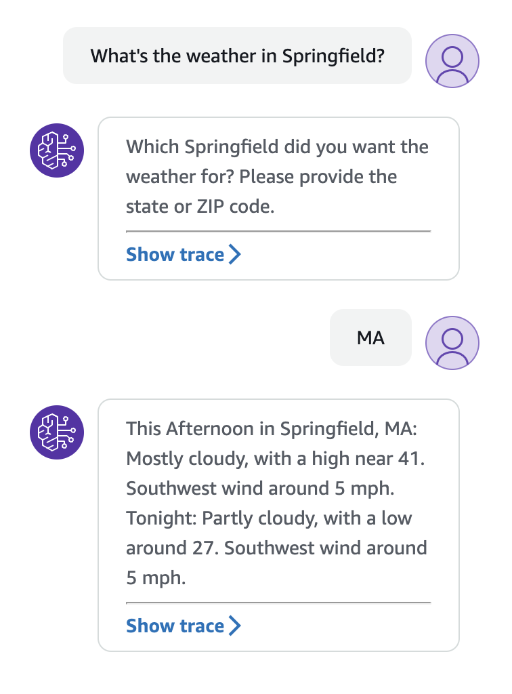

# bedrock-agents-demo
A sample Agents for Bedrock demo that retrieves the weather

Run the installer to deploy the solution. Once it completes, go to the **Agents** link in the Amazon Bedrock console. Select the agent and click the **Test** button. You will be able to retrieve weather information in the US for a location (city, state or ZIP code) that you specify.

